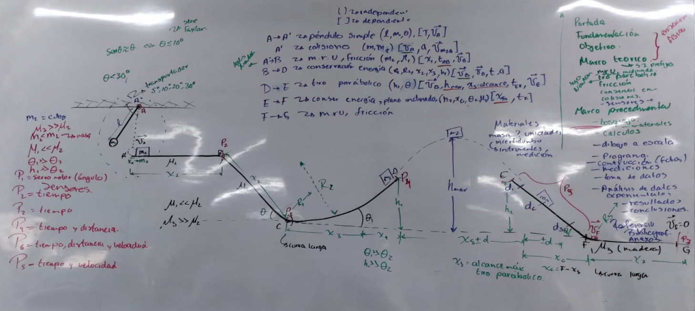
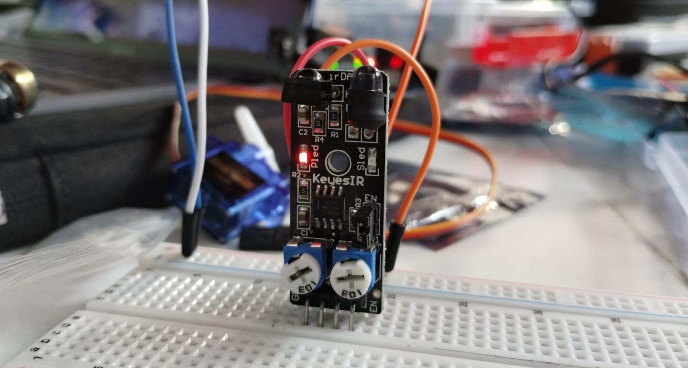
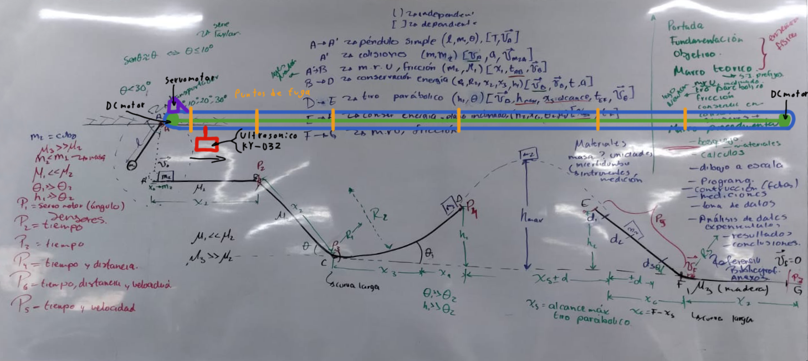
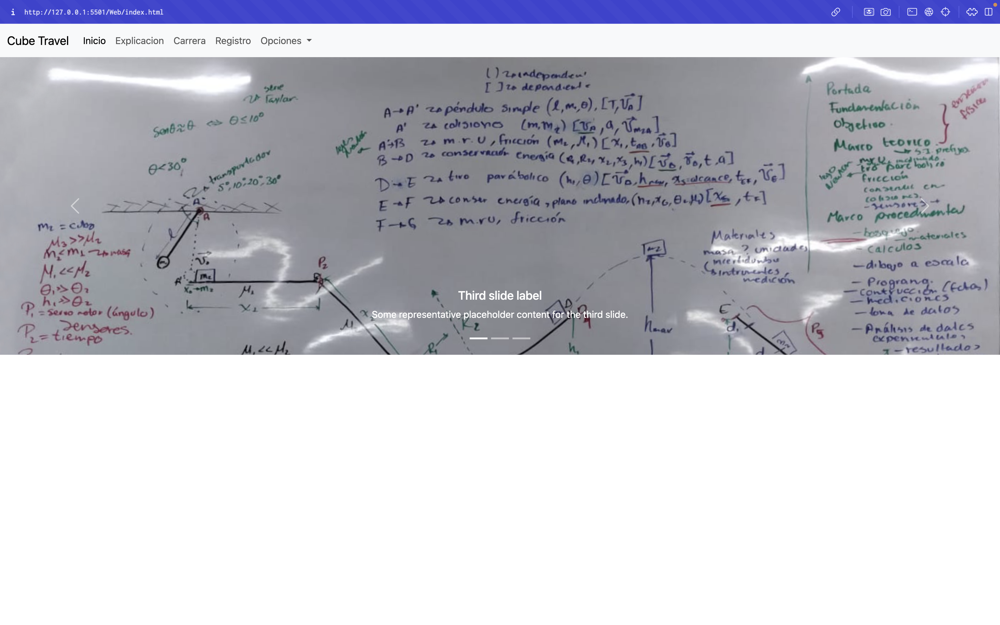
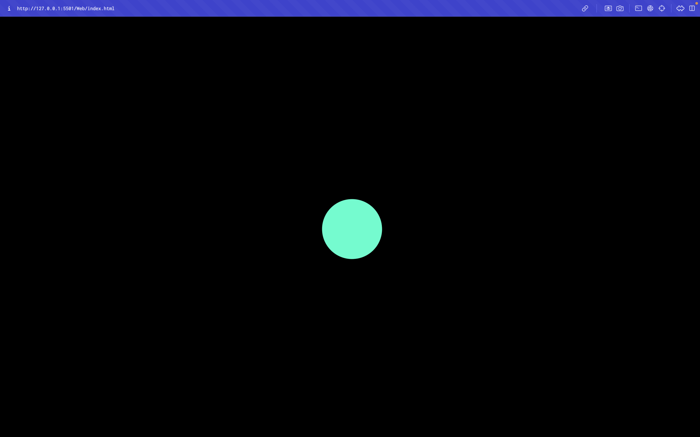
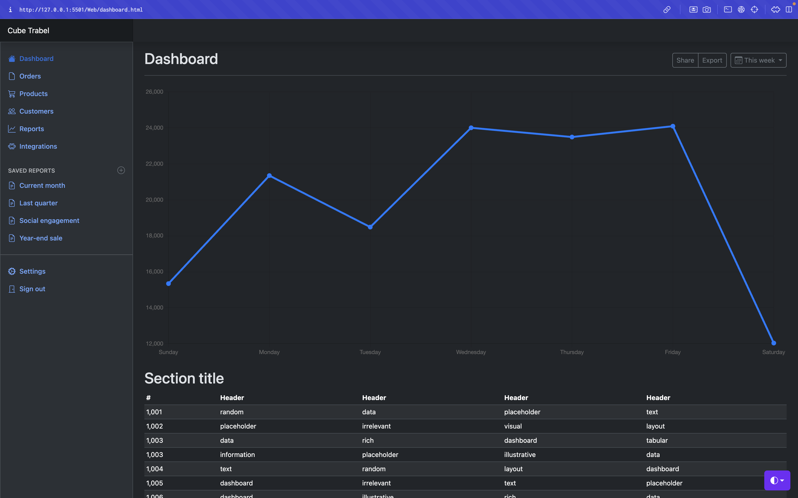
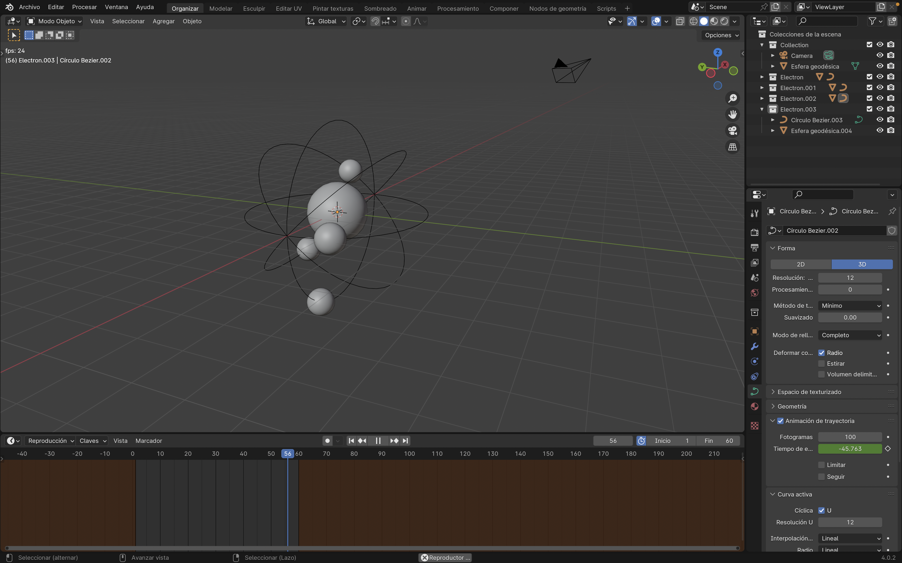

# Bitacora

## 27/02/2024
**Objetivo:** 

- Realizar el bosquejo del proyecto.

**Resumen:**

- Se llevo a cabo la reunion con la maestra Cynthia en el salon 25, en el cual se discutio sobre el proyecto.
- Se realizo el bosquejo de este junto con la planeacion sobre como implementar los sensores para obtener parametros para los calculos físicos.
- Inicio del Marco Teorico.

**Pendientes:** 

- [x] Hacer el marco teorico.
- [x] Decidir que sensores usar.
- [ ] Calculos físicos.
- [ ] Hacer dibujo a escala.
- [ ] Hacer dibujo a escala en AutoCAD.
- [ ] Hacer el marco teorico.
- [ ] Hacer pagina web.
- [ ] Programacion en c++ para operaciones y arduino.
- [ ] Base de datos para el registro de todos lo datos.
- [ ] Construccion.
- [ ] Pruebas y teoria de errores.

## 01/03/2024

**Objetivo:**

- Decidir que sensores usar.

**Resumen:**

- Diego y José hicieron pruebas con sensores ultrasonicos y de obstáculos KY-032 y KY-033.
- Se decidio usar sensor ultrasonico y sensor de obstaculos KY-032 por su precision para detectar un objeto.

**Pendientes:**

- [x] Decidir ubicacion de senspres.
- [x] Decidir cantidad de sensores.

## 02/03/2024

**Objetivo:**

- Planear la posicion de los sensores a lo largo de la pista.

**Resumen:**

- No se sabe que sensor usar en el punto P5 de la pista.
- Se decidio cambiar todos los sensores
- Se hara una estructura en la parte superior que movera al sensor que recorra toda la pista siguiendo al cubo que la recorra.
- Se usaran DC motores para mover el sensor y un servomotor para ayudar a detener el movimiento del sensor.

**Pendientes**

- [ ] Decidir materiales extra.

## 09/03/2024

**Objetivo:**

- Iniciar a desarrollar la pagina web.

**Resumen:**

- Se decidio hacer una web para la presentacion e informacion del proyecto y la consulta de los datos de cada carrera.
- Se creo un carrusel de imagenes sobre el proyecto.

**Pendientes**

- [x] Agregar la informacion del proyecto.
- [ ] Hacer dashboard sobre los datos.

## 11/03/2024

**Objetivo:**

- Continuar pagina web.

**Resumen:**

- Se decidio no continuar con la parte de la web sobre la presentacion e informacion del proyecto.
- Cassiel solicito poner un electron animado como pagina de inicio.
- Se empezo el desarrollo del electron para la pagina web.
- CSS no permite animaciones muy complejas, tal vez no sea posible hacerlo.

**Pendientes**

- [ ] Continuar con el desarrollo del electron.
- [ ] Buscar otras opciones para el desarrollo del electron.

## 15/03/2024

**Objetivo:**

- Continuar pagina web.

**Resumen:**

- Se empezo el desarrollo del dashboard de la pagina con una plantilla de bootstrap.
- Se continuo con la animacion para el electron.
- Se decidio mejor usar una animacion 3D para el electron junto con Three.js.
- Se empezo con el modelado 3D del electron.

**Pendientes**

- [ ] Continuar el modelo 3D del electron.
- [ ] Implementar el modelo 3D del electron con Three.js.
- [ ] Continuar desarrollo del dashboard.

